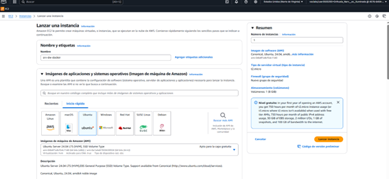

# AWS-DAW

Tienes que tener una clave de acceso a AWS Academy. En este caso entramos como “Student Login".

Hay que entrar con tu usuario y contraseña.

Le das a "Panel de Control" y seleccionas "curso".

Para activar AWS, en la página principal de Contenidos, seleccionas “Lanzamiento del Laboratorio para el alumnado de AWS Academy”. 

Una vez dentro en el botón Start Lab esperas a que inicialice, lo sabrás cuando al lado AWS se ponga la luz de color verde y aparezca un contador. No te olvides de darle a End Lab cuando termines para no gastar créditos innecesarios.

Le das a AWS

Buscas VPC y le das a crear VPC

Ponemos los siguientes items y le das a crear VPC

La vemos en "sus VPC"

Ahora vamos a crear dos subred.Damos al apartado Subredes y ahí al botón a la derecha que pone Creae Subred.
Rellenamos todo a nuestro gusto.

Y le das a agregar una nueva subre. Rellenas y le das a crear.

Deben aparecerte en tus Subredes.
Ahora vamos a crear una puerta de enlace a internet.

Rellenas con un nombre y le das a crear.

Le das a conectar a la VPC

Y conectas el Gateway

Ahora nos dirigimos a la sección Tablas de enrutamiento que hay a la izquierda en el Panel de VPC y le damos a Crear una tabla de enrutamiento. Ponemos un nombre, seleccionamos nuestra VPC y le damos a crear.

Buscamos en el buscados EC2 y le clicamos. Queremos lanzar una instancia. 

Volvemos a VPC. Entramos en subredes y cogemos la primera que hicimos, le damos a acciones y seleccionamos Editar la asociación de la tabla de enturamiento para poner la nuestra.

Volvemos a EC2 al apartado de instancias para conectarnos a la que habíamos creado.

Le doy a conectar para hacer la prueba con la misma cosa del ordenador (no SSH). Hacemos ping 8.8.8.8 y si devuelve cosas es que hay internet. Para actualizar ponemos sudo apt upgrade en el ubuntu. 
